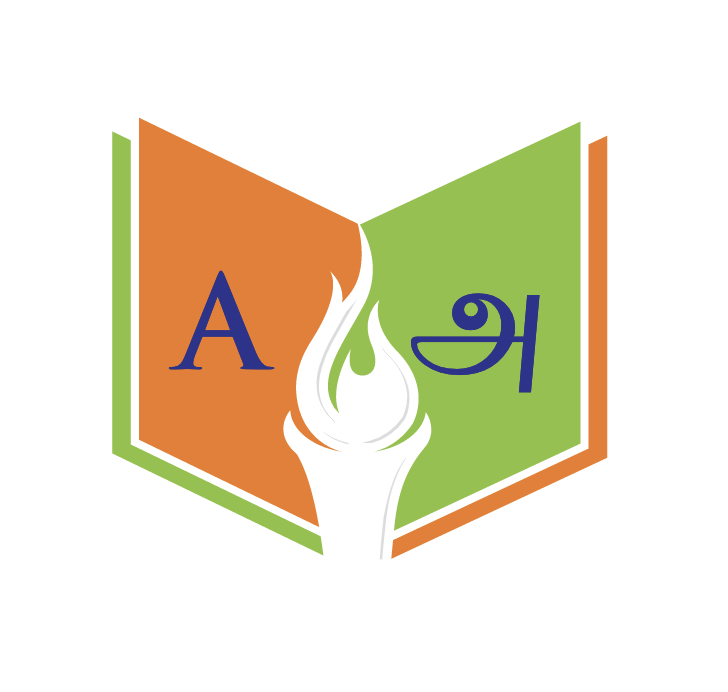
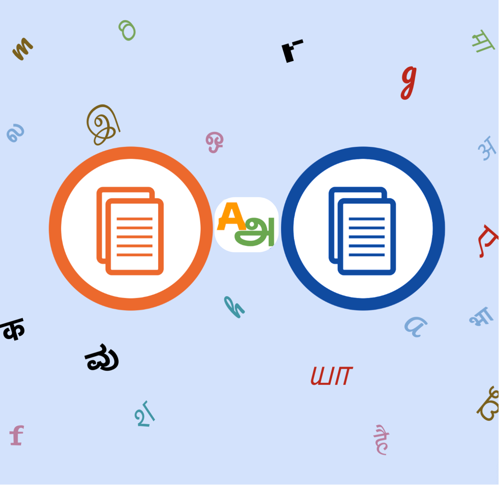

# Sunbird Anuvaad Overview

`Project Anuvaad` is an open-sourced project funded by EkStep foundation.

It was bootstrapped by EkStep Foundation in late 2019 as a solution to enable easier translation of legal documents from English to Indic languages & vice-versa. Creating Anuvaad platform allowed legal entities to digitize & translate the Orders/Judgements using an easy to use user interface.

Anuvaad is an AI based open source Document Translation Platform to _digitize and translate_ documents in Indic languages at scale. Anuvaad provides easy-to-edit capabilities on top the plug & play NMT models. Separate instances of Anuvaad are deployed to [Diksha](https://diksha.anuvaad.org/) (NCERT), [Supreme Court of India](https://government.economictimes.indiatimes.com/news/technology/ai-backed-suvas-translation-tool-intended-to-make-legalese-simpler-court-proceedings-faster-law-minister/102648151)(SUVAS) and [Supreme Court of Bangladesh](https://www.tbsnews.net/bangladesh/court/supreme-court-launches-translation-software-amar-vasha-204100) (Amar Vasha).

<figure><figcaption></figcaption></figure>

Anuvaad leverages state of the art AI/ML models including NMT, OCR, Layout detection to provide high level of accuracy. Project Anuvaad was envisioned to be end to end open sourced solution for document translation across multiple domains.

`Project Anuvaad` is REST APIs driven and hence any third party system can use various features like sentence translation, layout detection etc.

> <mark style="color:red;">NOTE: The documentation is still WIP. Feel free to contribute to it or raise issues if the desired info is not uptodate. Explore the KT videos if you would like to dive deep into each module.</mark>
