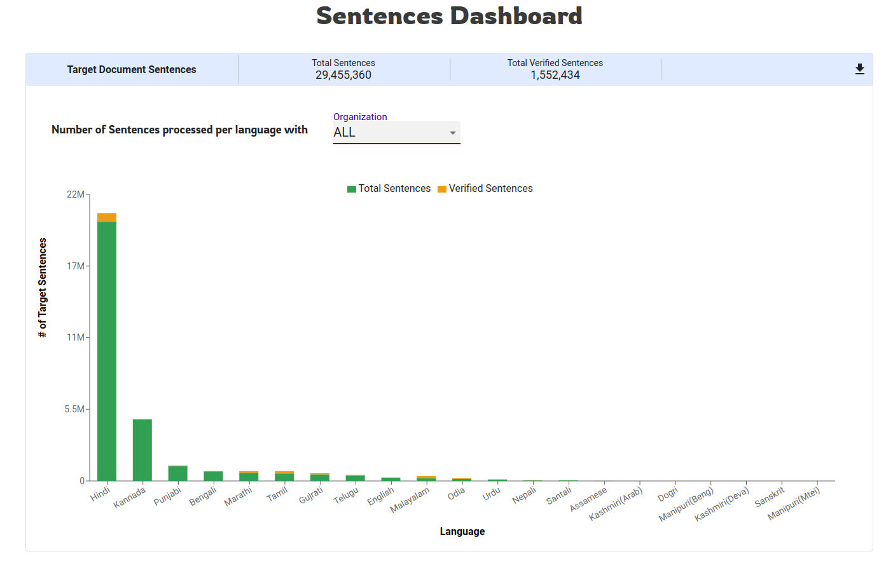

# Anuvaad Translator

### Overview

This document provides details about the translator service used in Anuvaad. Translator is a wrapper over the NMT and is used to send sentence by sentence to NMT for translation of the document.

### Getting Started

Translator receives input from the tokeniser module, the input is a JSON file that contains tokenised sentences. These tokenised sentences are extracted from the JSON file and then sent to NMT over kafka for translation. NMT expects a batch of ‘n’ sentences in one request, Translator created ‘m’ no of batches of ‘n’ sentences each and pushes to the NMT input topic. In parallel it also listens to the NMT’s output topic to recieve the translation of the batches sent. Once, all the ‘m’ no of batches are received back from the NMT, the translation of the document is marked complete.

Next, Translator appends these translations back to the JSON file received from Tokeniser, The whole of this JSON which is now enriched with translations against every sentence is pushed to Content Handler via API, Content Handler then stores these translations.

### TMX:

TMX is the system translation memory, A user can decide to override Anuvaad’s translation of a text/sentence by inserting ‘preferred translations’ into the system. TMX is backed by a redis store which hashes and stores user-specific translations for a text. This can be called as user’s personal cache of translations.

TMX provides three levels of cache-ing: Global, Org, User.

#### Global Level:

This is a global bucket of preferred translations where an ADMIN or a Global Level User can feed translations which will applied across users and orgs.

#### Org Level:

This a Org level bucket where Anuvaad translations are overridden by preferred translations to only those users who belong to a particular organisation. Any ADMIN or a Org Level user can feed these translations in to be overridden across users of his/her org.

#### User Level:

This a User level bucket where a User can feed in his/her preferred translations and the system will override Anuvaad translations only for this particular User.

TMX can be uploaded sentence by sentence or in bulk, both APIs are supported.

Example: [https://www.getpostman.com/collections/677974f4cfe1c3e119fb](https://www.getpostman.com/collections/677974f4cfe1c3e119fb)

### UTM:

UTM is User Translation Memory, This is slightly different from TMX, here there are no levels, This is totally and plainly a translation cache. Here, the system remembers the user's translation and applies it automatically when it encounters the same sentence for the same user.

Let’s say, We have a sentence ‘S1’ in a document ‘D1’, Anuvaad’s translation of this sentence is ‘T1’. Let’s say that the user on encountering this, changes the translation ‘T1’ of sentence ‘S1’ to ‘T2’. Now, Anuvaad remembers this such that, in any document, say ‘D2’ in this case, whenever there’s ‘S1’ and NMT translates it to ‘T1’, Anuvaad automatically overrides the translation to ‘T2’. However, let’s say NMT got better with time and now translates ‘S1’ to ‘T3’, in this case, Anuvaad dosen’t override it because the user context was ‘S1’ —> ‘T1’ and not ‘S1’ —> ‘T3’.

<figure><figcaption></figcaption></figure>

### Modules

[API Details Postman](https://www.getpostman.com/collections/61e432cbddbb59a38072)&#x20;

### Source Code:

&#x20;[https://github.com/project-anuvaad/anuvaad/tree/master/anuvaad-etl/anuvaad-translator](https://github.com/project-anuvaad/anuvaad/tree/master/anuvaad-etl/anuvaad-translator)
